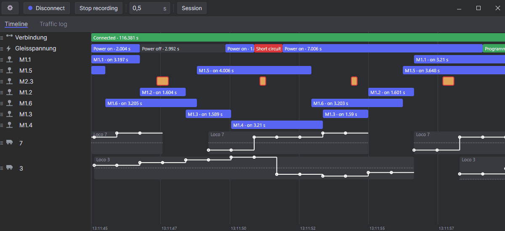

# Z21 Feedback Sniffer

A Windows tool for tracking down flaky feedback on a model railway.

I built this because of ghost occupancies: a track section that says it's occupied when nothing is
on it. They're a pain to find. The blip is short and it's gone again before you can look at the
controller, so you never see what happened. The app sits on the network and watches all the R-Bus
feedback coming off a Roco/Fleischmann Z21. Every contact gets its own row on a timeline, and each
time it goes on you get a bar. A sensor that misbehaves ends up with a scatter of little bars on its
row, and you can see when it fired and how long it stayed on.



## What it does

- Connects to the Z21 over UDP at the controller's IP address.
- Draws the R-Bus feedback as a timeline that pans, zooms and pauses while it runs.
- Shows each locomotive's speed and direction as a stepped graph in its row.
- Logs the raw traffic too: sensor edges, station readings like current, voltage and temperature,
  fault flags, loco and turnout messages, all filterable.
- Writes a recording out as JSON and reads it back later.
- Renames sensors, so "Module 3 / Contact 5" can just be "Station track 2".
- Has a simulator built in for when there's no Z21 plugged in.
- Runs an MCP server an AI assistant can query against a live recording.

## Building and running

You'll need the .NET 8 SDK on Windows.

```powershell
dotnet build "src\Z21Sniffer.UI.Desktop\Z21Sniffer.UI.Desktop.csproj"
.\src\Z21Sniffer.UI.Desktop\bin\Debug\net8.0-windows\Z21Sniffer.UI.Desktop.exe
```

## License

[MIT](LICENSE) © 2026 Jakob Eichberger
